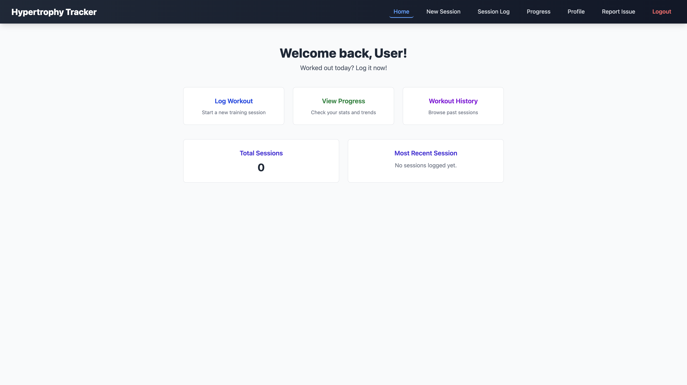
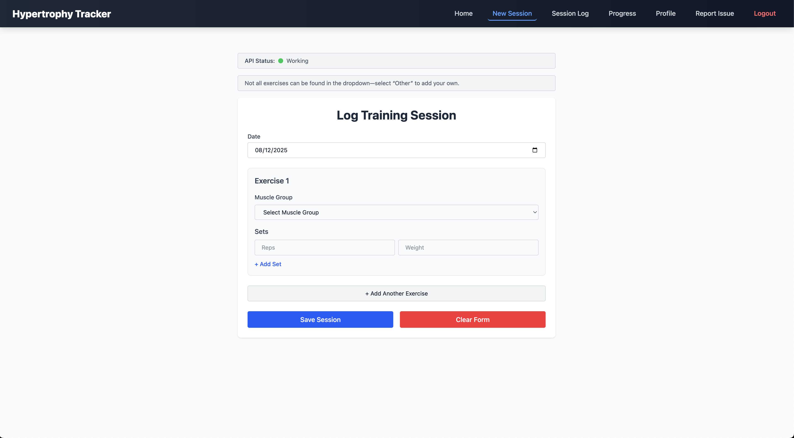

# Hypertrophy Tracker

A full-stack fitness tracking application designed for strength athletes, bodybuilders, and anyone looking to monitor their progress. The app allows users to log workouts, track performance over time, and visualize strength gains.

## Live Demo
[**View on Vercel**](https://your-vercel-link.com)  
[**API on Render**](https://your-backend-link.com)

---

## Features
- **Workout Logging** – Record exercises by muscle group with multiple sets, reps, and weights.
- **Repeat Workouts** – Reuse full workout sessions (e.g., Push Day, Back Day) with preset exercises.
- **Progress Tracking** – Interactive charts for performance over time, with exercise and date range filters.
- **User Authentication** – Secure login & registration with JWT authentication.
- **Responsive UI** – Optimized for desktop and mobile.
- **Report Issues** – In-app form to send bug reports or feedback.

---

## Tech Stack
**Frontend**  
- React + TypeScript  
- Tailwind CSS  
- Vite  
- Deployed on Vercel  

**Backend**  
- Node.js + Express  
- MongoDB + Mongoose  
- JWT Authentication  
- Deployed on Render  

---

## Screenshots

### Dashboard


### Workout Logging


---

## Installation & Setup

### Prerequisites
- Node.js (v18+ recommended)
- MongoDB (local or Atlas instance)

### Frontend Setup
```bash
cd hypertrophy-frontend
npm install
npm run dev
```

### Backend Setup
```bash
cd hypertrophy-frontend
npm install
npm run dev
```

